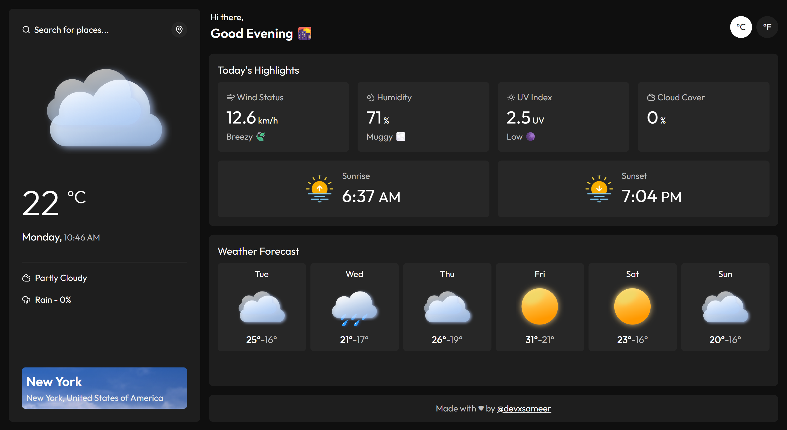

# 🌪️ Zephyr — A Modern Weather App

A minimal, responsive weather app that delivers real-time forecasts with a clean UI and reliable APIs. Built with **Vanilla JavaScript**, **Webpack**, and **date-fns** as part of [The Odin Project](https://www.theodinproject.com/) curriculum.



---

## 🚀 Live Demo

**👉 [View the live project here!](https://devxsameer.github.io/zephyr/)**

---

## ✨ Features

- **City Search**: Dynamically search for any city in the world with real-time suggestions.
- **Current Weather**: Get instant, up-to-date weather conditions.
- **5-Day Forecast**: Plan ahead with a detailed forecast for the next five days.
- **Today's Highlights**: See detailed metrics like wind speed, humidity, UV index, and cloud cover.
- **Sunrise & Sunset**: View daily sunrise and sunset times, adjusted for the location's timezone.
- **Unit Toggling**: Seamlessly switch between Celsius and Fahrenheit.
- **Responsive Design**: A clean and consistent experience on both desktop and mobile devices.

---

## 🛠️ Tech Stack & APIs

### Frontend

- **Vanilla JavaScript (ES6 Modules)**: For all core application logic.
- **Webpack 5**: For bundling modules and assets for production.
- **date-fns**: A lightweight library for modern date and time manipulation.
- **Lucide Icons**: For beautiful and consistent icons throughout the app.
- **HTML5 & CSS3**: For structure and styling.

### Development Tools

- **ESLint**: For static code analysis and enforcing code quality.
- **Prettier**: For automated code formatting.
- **Husky & lint-staged**: For running linters on pre-commit hooks.

### APIs Used

- [**Open-Meteo**](https://open-meteo.com/): Used for the Geocoding API (city search) and the 5-Day Forecast API.
- [**WeatherAPI**](https://www.weatherapi.com/): Used for real-time current weather data.

---

## ⚡ Getting Started  

### Prerequisites

- Node.js (v18 or higher)
- npm
- A free API key from [WeatherAPI.com](https://www.weatherapi.com/)

### Installation & Setup

1.  **Clone the repository:**

    ```bash
    git clone https://github.com/devxsameer/zephyr.git
    cd zephyr
    ```

2.  **Install dependencies:**

    ```bash
    npm install
    ```

3.  **Set up your API key:**
    For local development, you will need to place your API key directly into the `src/modules/api.js` file.
    ```javascript
    // in src/modules/api.js
    const API_KEY = "YOUR_API_KEY_HERE";
    ```

### Available Scripts

- **Run in development mode:**
  Starts the webpack dev server with hot reloading.

  ```bash
  npm run dev
  ```

- **Build for production:**
  Bundles and optimizes the application for deployment. The output is saved to the `dist/` folder.

  ```bash
  npm run build
  ```

- **Linting and Formatting:**
  ```bash
  npm run lint       # Check for linting errors
  npm run lint:fix   # Automatically fix linting errors
  npm run format     # Format all code with Prettier
  ```

---

---

## 📝 License

This project is licensed under the ISC License. See the [LICENSE](LICENSE) file for details.

---

## 👨‍💻 Author

- **Sameer Ali** - [GitHub: @devxsameer](https://github.com/devxsameer)
